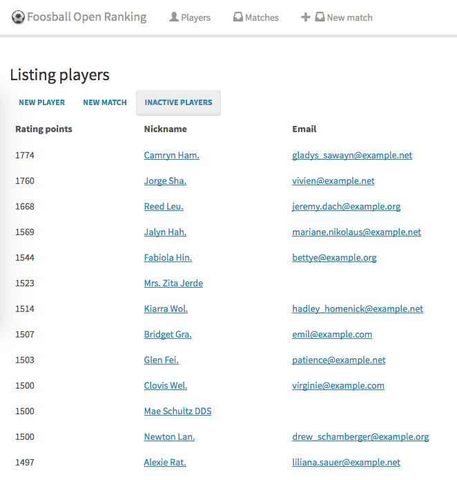
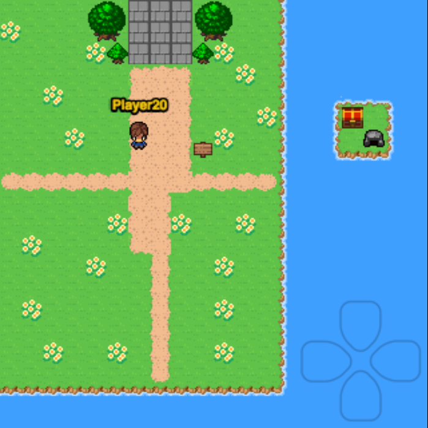
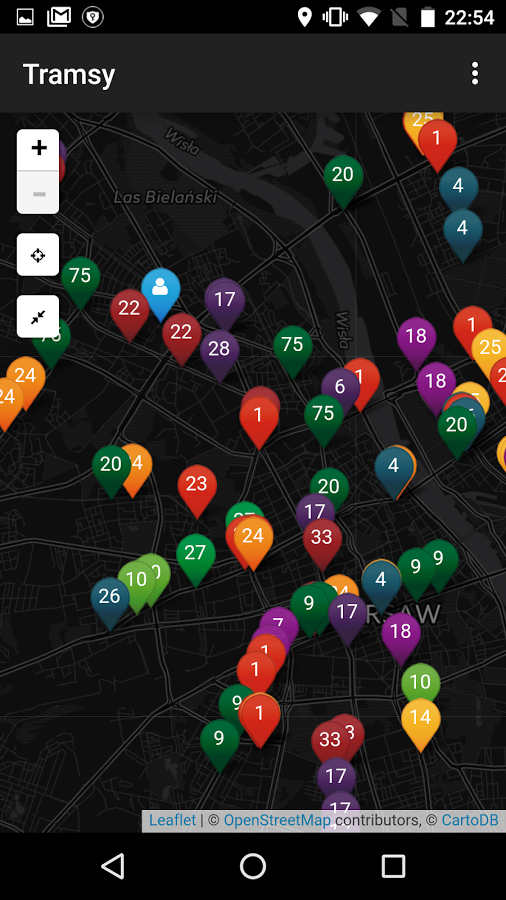
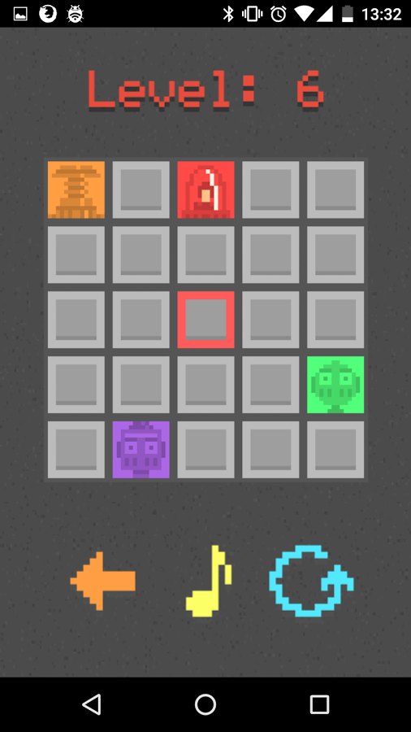

## Foosball - Author [production]
In our company there was always a doubt who is the best in Foosball. So I created this ranking website to reveal the best players!

[[Demo]](http://demo-foos.ipepe.pl/)
[[Github]](https://github.com/ipepe/foosball-open-ranking)

## MMORPG in browser - Author [prototype]
Just having fun with phaser and websockets.

[[Github]](https://github.com/ipepe/sinatra-phaser-mmo)

## Trams - Author [production]
Probably one of first in Poland applications that show trams locations in real time.

[[Production]](https://play.google.com/store/apps/details?id=pl.ipepe.android.real_trams_map)
[[Github]](https://github.com/ipepe/android-warsaw-tram-map)

## Alphatrix - Author [production]
Alphatrix is addictive mind puzzling game.

[[Production]](https://play.google.com/store/apps/details?id=pl.ipepe.android.alphatrix)

## Portfolio Template - Refactor Author
I made this template for my friend. Gulp made it unusable for GitHub pages with ease so I refactored it into Jekyll and now everything is configurable.

[[Github]](https://github.com/ipepe/portfolio-template)
[[Demo]](https://ipepe.github.io/portfolio-template/)

